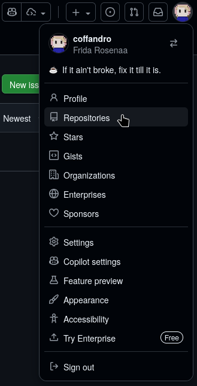
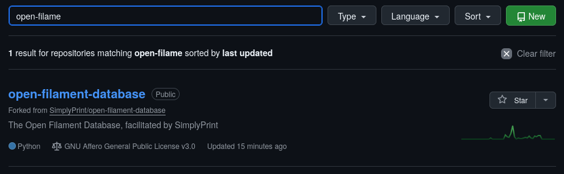
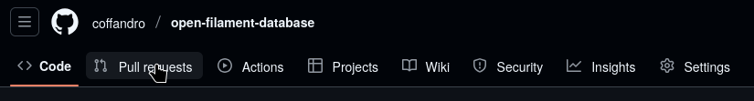
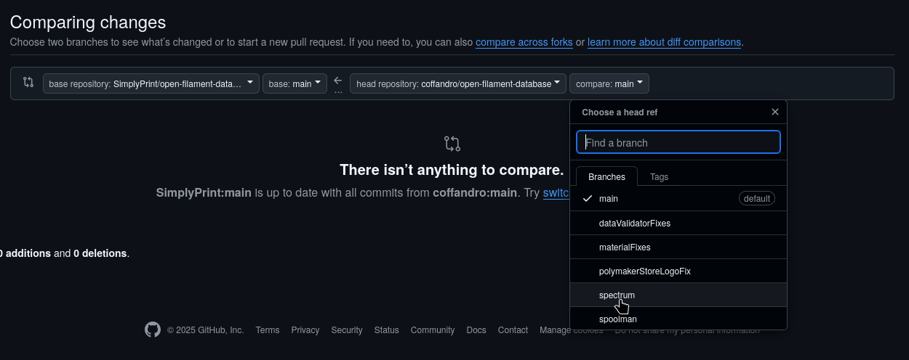

# Pull requesting
To make a pull request we assume you have your data in the cloud already so let's get started!

To begin with we'll go to this link, the pull requests tab of the main database
https://github.com/SimplyPrint/open-filament-database/pulls
If you've pushed a yellowish banner will appear, click the compare and pull request button.  
  
You should be brought to a page that looks like this, simply change the title to whatever describes what you've changed and write a short description about the same  
  
When you're ready press the `Create pull request` button and wait for someone to come merge it, or be ready for some feedback \:D

### Alternative method
If the last method didn't work it is also possible to go to your profile, and go to your repositories \
 \
After getting to your repository list you can search up your version of the database \
 \
Click on the database and then the pull requests tab \
 \
You can then click the "New Pull request" button \
 \ 
And find your branch on the right side \

And then you just fill it out with whatever info you think we need and wait for someone to come merge it, or be ready for some feedback \:D
